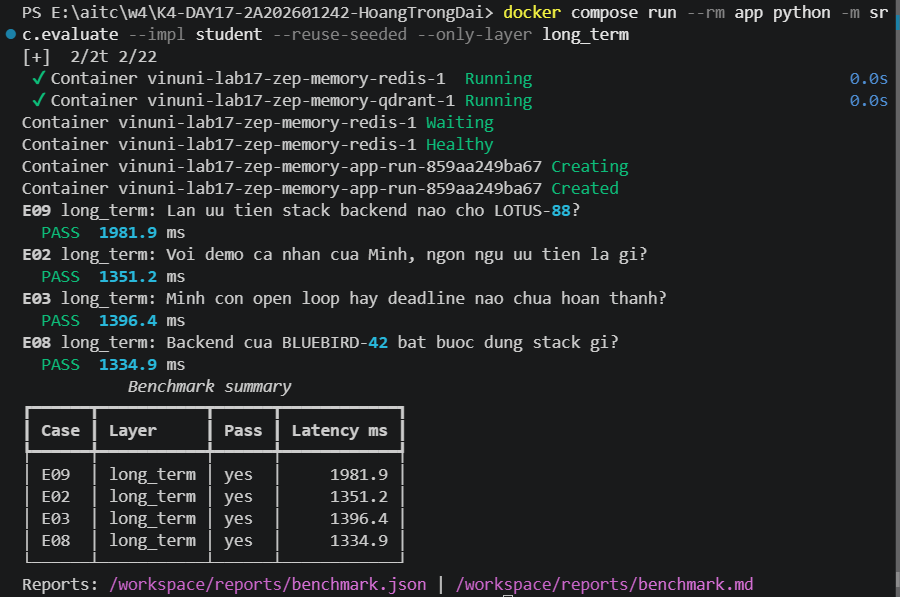
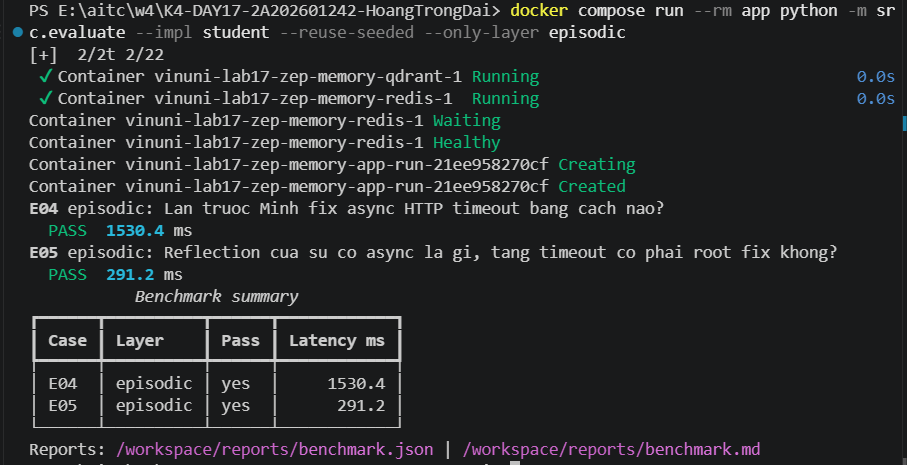
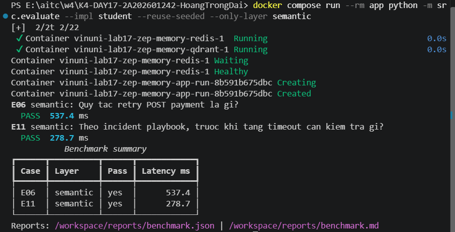
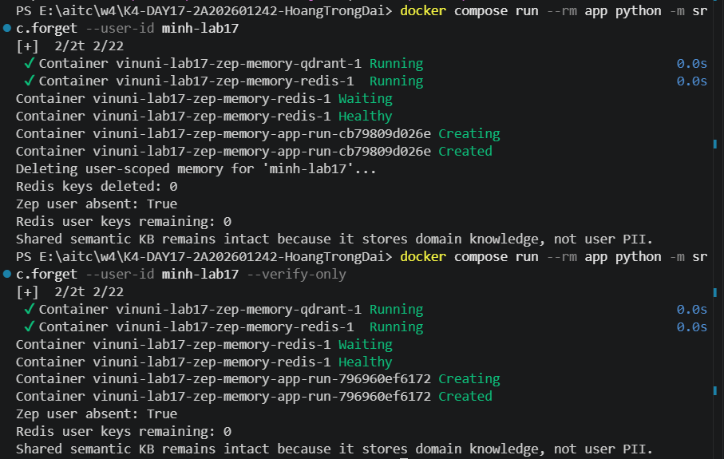

# README Submission - Lab 17 Multi-Memory Agent voi Zep

## Ket qua benchmark

- Student: **11/11 PASS**, hit rate **100%**, avg latency 1458ms, avg token reduction 14.2%.
- No-memory baseline: **2/11 PASS**, hit rate 18.2%, avg token reduction 81.8%.
- Chi tiet: `reports/benchmark.md`, `reports/benchmark_no_memory.md`, `reports/comparison.md`.

## 4 cau phan tich benchmark

**1. Layer nao hit rate thap nhat?** O ban student ca 4 layer deu 100%. Su khac biet lo ro khi tat memory: no-memory lam long_term, episodic, semantic va mixed rot ve 0%, chi short_term (E01, E10) con PASS vi bang chung nam san trong vai luot chat gan nhat. Long_term la layer de FAIL nhat neu sai scope/`user_id`.

**2. Query nao retrieve nhieu token nhat?** E02 va E08 (~1510-1527 token, long_term), cao nhat trong 11 case, vi Context Block tra ve ca USER_SUMMARY thay vi 1 fact rieng le - long-term nang token hon episodic/semantic (~150-270 token/case).

**3. E07 (mixed) can layer nao?** long_term + semantic. Evidence bat buoc: `Python` (long-term preference cua Minh) va `Idempotency-Key` (semantic KB retry payment). Thieu 1 trong 2 se FAIL.

**4. Token reduction vs full source, vi sao no-memory cao hon nhung hit rate thap?** No-memory dat 81.8% (cao hon student 14.2%) chi vi khong retrieve gi ca (0 token o 9/11 case). Giam token khong dong nghia retrieval tot - phai xet cung hit rate.

## 3 cau phan tich (muc 5.2)

**Layer quan trong nhat trong bo test nay:** long_term - chiem 4/11 case (E02, E03, E08, E09), de mat diem nhat neu sai scope/user_id (E09 kiem tra isolation Lan/Minh). E08 minh hoa recency: fact BLUEBIRD-42/TypeScript/NestJS moi duoc uu tien hon ORCHID-27/Python cu.

**Trade-off Context Block (Zep) vs Redis+Qdrant tu build:** Context Block tu dong extract fact, xu ly recency/conflict, xep hang relevance, khong can tu code retrieval; doi lai it kiem soat schema va co do tre mang (~1-2s/query). Redis+Qdrant toan quyen kiem soat schema/TTL nhung phai tu code het conflict/recency/consolidation.

**Guardrail chong memory poisoning:** `src/heartbeat.py` chi de-duplicate va danh dau stale task, khong tu them instruction/quyen moi vao durable memory; moi durable note can provenance (source, timestamp) theo `control_plane/MEMORY_SCHEMA.md`; `src/privacy_guard.py` chan ingest khi `memory_opt_in=false`.

## Ghi chu them

**E10 (compaction):** giam `max_recent_messages` 6→4, sliding window van giu `REVIEW-DEADLINE-1600` nho durable note tach khoi buffer, du raw turn da bi cat.

## Bang chung

